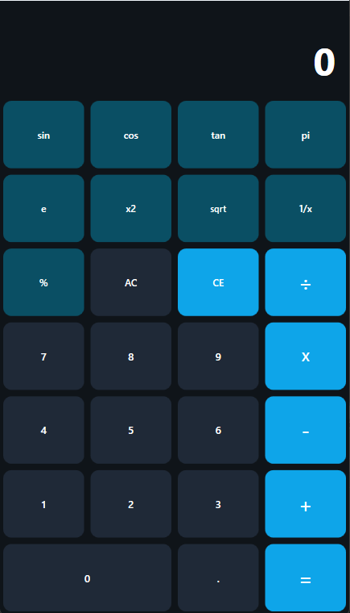

# 🧮 Calculatrice Lucas

Une calculatrice WPF moderne et complète développée en C# avec un design élégant et sombre.

## 📋 Description

**Calculatrice Lucas** est une application de bureau Windows Presentation Foundation (WPF) offrant des fonctionnalités de calcul avancées. Avec son interface intuitive et son design moderne, elle permet d'effectuer des calculs basiques et scientifiques de manière fluide et agréable.

### Caractéristiques techniques
- **Langage** : C# 14.0
- **Framework** : .NET 10
- **Interface** : WPF (Windows Presentation Foundation)
- **Thème** : Dark Mode avec accents cyan

---

## ✨ Fonctionnalités

### Opérations Basiques
- ➕ **Addition**
- ➖ **Soustraction**
- ✖️ **Multiplication**
- ➗ **Division** (avec protection contre division par zéro)

### Opérations Scientifiques
- 📐 **Trigonométrie** : Sin, Cos, Tan (en degrés)
- 🔢 **Puissance** : Carré (x²)
- √ **Racine carrée** (avec validation des nombres négatifs)
- 1/x **Inverse** (avec protection contre division par zéro)
- ±  **Changement de signe**
- % **Pourcentage**

### Constantes Mathématiques
- π **Pi** (3.141592653589793)
- e **Nombre d'Euler** (2.718281828459045)

### Utilitaires
- ⌫ **Backspace** : Supprime le dernier chiffre
- C **Effacer** : Réinitialise complètement la calculatrice
- **, (virgule)** : Séparateur décimal

---

## 🎨 Choix de Conception

### Architecture
- **Pattern MVVM-like** : Code-behind simplifié avec logique métier claire
- **Séparation des responsabilités** : Interface (XAML) et logique (C#) bien séparées

### Interface Utilisateur
- **Design sombre** : Réduction de la fatigue oculaire (#0F1419)
- **Couleurs d'accent** : Cyan (#0EA5E9) pour les boutons d'action
- **Affichage dual** : 
  - Ligne secondaire affichant l'opération en cours
  - Ligne principale affichant le nombre/résultat
- **Coins arrondis** : Buttons avec `BorderRadius="10"` pour un aspect moderne
- **Feedback visuel** : Changement de couleur au survol des boutons

### Gestion des Erreurs
- Messages d'alerte pour les opérations invalides (division par zéro, racine négative)
- Validation des entrées utilisateur
- Réinitialisation sécurisée des états

### Stockage des Données
- **float** : Précision suffisante pour les calculs courants
- Variables d'état : `First_nb`, `Second_nb`, `Result`, `Operation`

---

## ⌨️ Raccourcis Clavier

| Raccourci | Action |
|-----------|--------|
| `0-9` | Saisir les chiffres |
| `+` | Addition |
| `-` | Soustraction |
| `*` | Multiplication |
| `/` | Division |
| `Enter` ou `=` | Calculer le résultat |
| `C` | Effacer tout |
| `Backspace` | Supprimer le dernier chiffre |
| `,` ou `.` | Virgule décimale |

*Note: Les raccourcis clavier peuvent être ajoutés/améliorés dans les versions futures via l'ajout d'event handlers globaux.*

---

## 🖼️ Captures d'Écran



---

## 📦 Installation

### Prérequis
- Windows 10 ou supérieur
- .NET 10 Runtime

### Compilation
```bash
git clone https://github.com/l-sauvinet/Calculator.net
cd CalculateurLucas
dotnet build
dotnet run
```

---

## 📝 Utilisation

1. **Entrez vos nombres** en cliquant sur les boutons numériques
2. **Sélectionnez une opération** (+, -, *, /)
3. **Entrez le deuxième nombre**
4. **Appuyez sur "="** pour voir le résultat
5. **Utilisez les fonctions scientifiques** directement sur le nombre affiché

### Exemples
- Calcul : `5 + 3 =` → `8`
- Trigonométrie : Saisir `90` → Cliquer `Sin` → `1`
- Racine : Saisir `16` → Cliquer `√` → `4`

---

## 🚀 Améliorations Futures

- [ ] Raccourcis clavier complets
- [ ] Historique des calculs
- [ ] Thèmes personnalisables (clair/sombre)
- [ ] Fonctions supplémentaires (logarithme, exponentielle, etc.)
- [ ] Support de la notation scientifique
- [ ] Copier/Coller depuis le presse-papiers
- [ ] Tests unitaires

---

## 👨‍💻 Auteur

**Lucas Sauvinet** - [GitHub](https://github.com/l-sauvinet)

---
